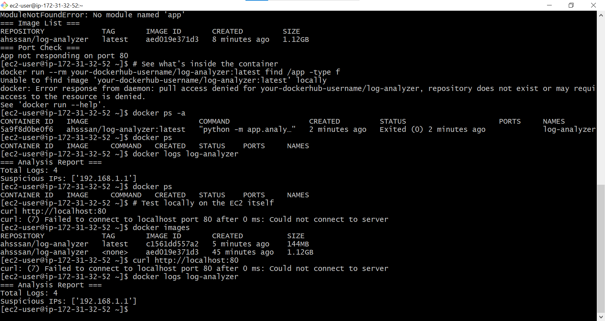
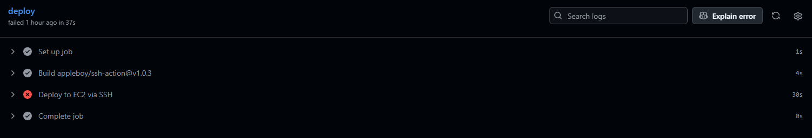
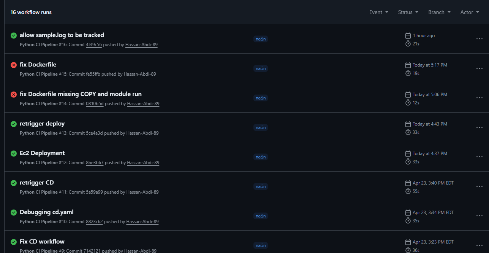
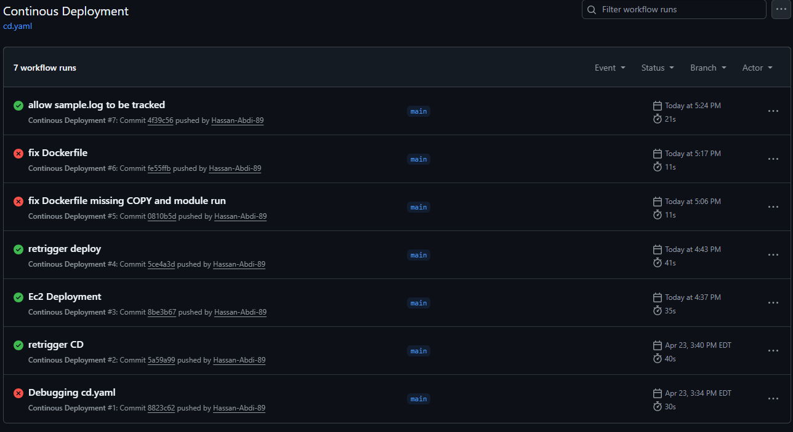
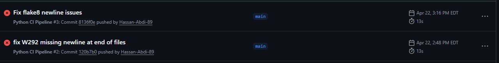

# CICD---Pip3lin3

🔍 Log Analyzer — Automated CI/CD Pipeline
A Python-based log analysis tool that detects suspicious IPs and brute-force activity, with a fully automated CI/CD pipeline using GitHub Actions, Docker Hub, and AWS EC2.

 What I Built
I built a Log Analyzer application that reads server log files, parses each entry, detects suspicious activity such as brute-force login attempts, and outputs a summary report.
The application is fully containerized with Docker and deployed automatically to an AWS EC2 instance through a 3-stage CI/CD pipeline built with GitHub Actions.
Every time code is pushed to main:

The code is automatically linted and tested
A Docker image is built and pushed to Docker Hub
The latest image is pulled and redeployed on AWS EC2 — with zero manual steps

Sample Output:
```
=== Analysis Report ===
Total Logs: 4
Suspicious IPs: ['192.168.1.1']
```

---
 
## 📁 Project Structure
 
```
Log_syst/
├── app/
│   ├── __init__.py          # Makes app a Python package
│   ├── analyzer.py          # Core log analysis logic
│   ├── utils.py             # Helper functions (parsing, detection)
│   └── sample.log           # Sample log file for testing
├── test/
│   └── test_analyzer.py     # Unit tests using pytest
├── .github/
│   └── workflows/
│       ├── main.yaml        # CI Pipeline (lint + test)
│       ├── cd.yaml          # CD Pipeline (Docker build + push)
│       └── deploy.yaml      # Deploy Pipeline (EC2 deployment)
├── .flake8                  # Flake8 linting configuration
├── .gitignore               # Git ignored files
├── Dockerfile               # Docker container definition
├── requirements.txt         # Python dependencies
└── README.md                # Project documentation
```
 
---
##  Local Development
 
```bash
# Clone the repo
git clone https://github.com/Hassan-Abdi-89/CICD---Pip3lin3
cd Log_syst
 
# Install dependencies
pip install -r requirements.txt
 
# Run the analyzer
python -m app.analyzer sample.log
 
# Run tests
pytest
 
# Run linting
flake8 .
```
 
---

### 1. Flake8 W292 — Missing Newline at End of File
**Problem:** CI failed with `W292 no newline at end of file` on all Python files.
 
**Cause:** Files were created without a trailing newline, and `echo ""` on Windows Git Bash adds wrong line endings.
 
**Fix:** Used Python to append a proper Unix newline:
```bash
python -c "
files = ['analyzer.py', 'utils.py', 'test/test_analyzer.py']
for f in files:
    with open(f, 'rb+') as file:
        file.seek(-1, 2)
        if file.read(1) != b'\n':
            file.write(b'\n')
"
```




---
### 3. EC2 SSH Timeout
**Problem:** Deploy pipeline failed with `dial tcp: i/o timeout` on port 22.
 
**Cause:** EC2 Security Group only allowed SSH from my personal IP, blocking GitHub Actions servers.
 
**Fix:** Updated the inbound rule for port 22 to allow `0.0.0.0/0` so GitHub Actions could connect.



 
---

### 4. sample.log Blocked by .gitignore
**Problem:** `git add sample.log` failed with `The following paths are ignored`.
 
**Cause:** `.gitignore` contained `*.log` which matched `sample.log`.
 
**Fix:** Added a negation rule to `.gitignore`:
```gitignore
*.log
!sample.log
```

 
---





---

## 📚 What I Learnt
 
**GitHub Actions**
- How to write multi-stage CI/CD workflows in YAML
- How to chain workflows using `workflow_run` so deploy only triggers after CD passes
- How to use `[skip ci]` in commit messages to prevent unnecessary pipeline runs
- How to store sensitive credentials safely using GitHub Secrets

**Python & Code Quality**
- How to structure a Python project as a package using `__init__.py`
- How to enforce code style with flake8 and fix W292 (missing newline at end of file)
- How `.gitignore` wildcard rules like `*.log` can accidentally block important files
---

